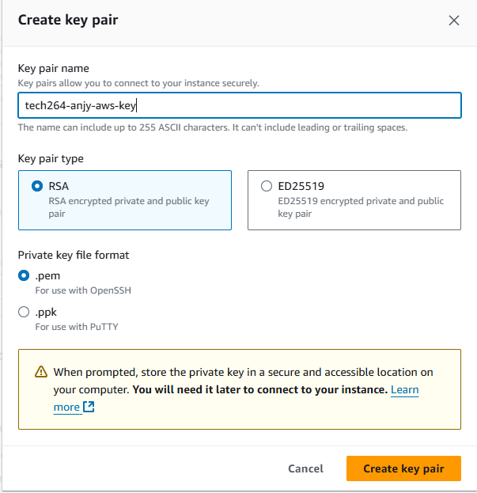
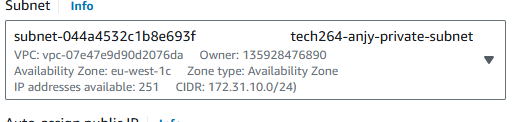
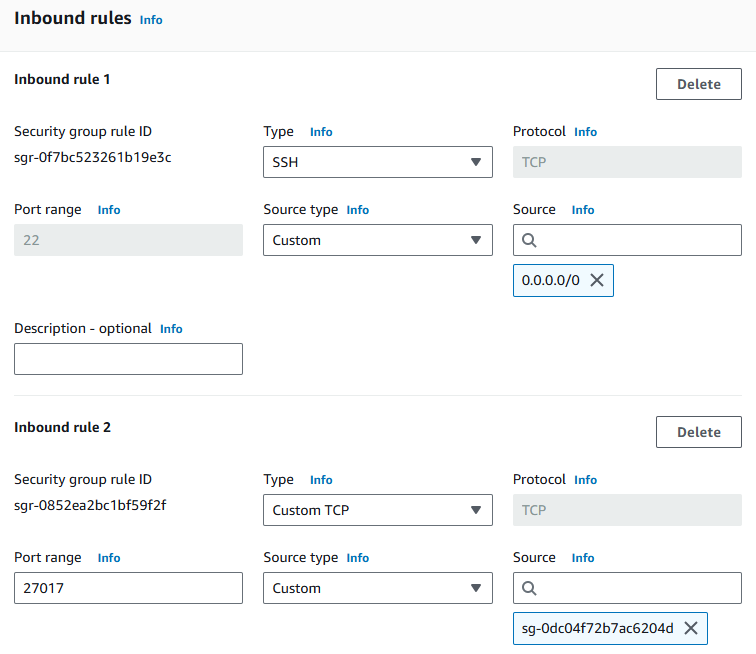
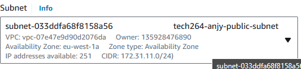
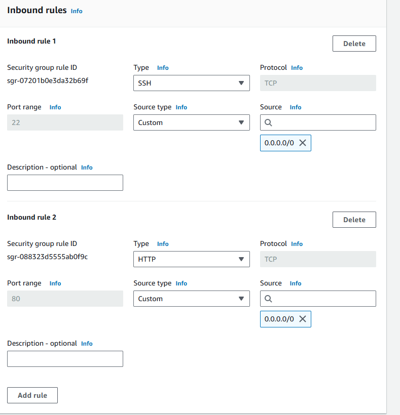

- [AWS](#aws)
  - [Create 2 tier App VM](#create-2-tier-app-vm)
    - [Create DB VM](#create-db-vm)
    - [Create app VM](#create-app-vm)
- [Jenkins](#jenkins)

# AWS
**As soon as you log in, change your region to Ireland**

Reason for this task: Consolidation of what you've done, show how fast you can deploy the app using your scripts
## Create 2 tier App VM

### Create DB VM
1. search ec2
2. click launch an instance
3. chose an appropriate name
4. choose unbuntu 22.04 - free tier
5. 64- bit architecture
6. instance type - t2.mirco
7. create a key pair on aws

1. the key will be downloaded- move the .pem (your private key) file to .shh repo - run the chmod command
2. Network settings
   1. Edit the network settings and choose the default VCP
   2. create a private subnet  
   3. name it and choose your subnet IP

   1. make one your public subnet too
   2. enable public IP
   3. Create a security group - name it (tech264-anjy-app-allow-HTTP-SSH)
   4. allow only SSH
   5. allow mongo port 27017 - source the app vm
   
1.  leave config. storage
2.  Advanced details 
    1.  scroll to the bottom and add your db user data
3.  launch
4.  connect to your instance to test - SSH client

### Create app VM

1. follow steps for db vm
2. in network settings - select the public subnet (create earlier)

1. Create a security group - name it
   1. allow ssh and http

1. put in your app user data in the advanced tab - make sure you change mongo db ip to your db private ip address
2. check your public IP and post page

# Jenkins

