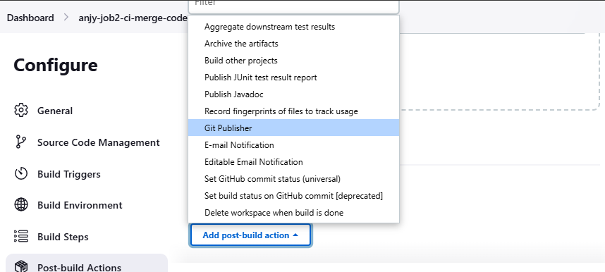
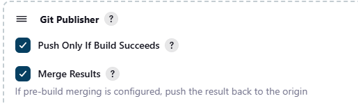
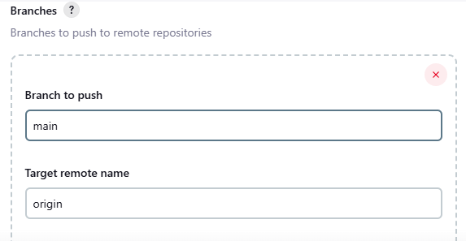
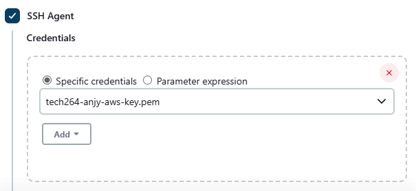

# Table of contents
- [Table of contents](#table-of-contents)
- [CI/CD pipelines using Jenkins](#cicd-pipelines-using-jenkins)
  - [Terminology](#terminology)
  - [Purpose](#purpose)
    - [Why a pipeline?](#why-a-pipeline)
    - [Why Jenkins?](#why-jenkins)
    - [Business value?](#business-value)
  - [CI/CD Pipeline Diagram](#cicd-pipeline-diagram)
  - [Access your Jenkins server](#access-your-jenkins-server)
  - [Make your mini pipeline (a job)](#make-your-mini-pipeline-a-job)
  - [To get jobs to run on after another](#to-get-jobs-to-run-on-after-another)
  - [3 job pipeline](#3-job-pipeline)
    - [Diagram](#diagram)
    - [Generate a new SSH key pair for jenkins to auth github](#generate-a-new-ssh-key-pair-for-jenkins-to-auth-github)
    - [Make a repo for the CI/CD pipeline](#make-a-repo-for-the-cicd-pipeline)
      - [To test!](#to-test)
    - [Use the public key to "place a lock" on our public repo](#use-the-public-key-to-place-a-lock-on-our-public-repo)
    - [Job 1!](#job-1)
      - [IF...](#if)
    - [Set up the webhook - on github (the listening side of the webhook)](#set-up-the-webhook---on-github-the-listening-side-of-the-webhook)
    - [Job 2!](#job-2)
    - [Job 3!](#job-3)


# CI/CD pipelines using Jenkins

## Terminology  
In **Jenkins**, a **node** refers to a machine that Jenkins manages, which can either be the **master** (now called **controller**) or an **agent**. Here's what they mean in detail:

1. Master (Controller) Node:
The **master** (or controller) is the main Jenkins server where the Jenkins instance runs.
- It manages:
  - **Job scheduling**: Determines which jobs to run and when.
  - **Build dispatching**: Distributes jobs to available agents.
  - **Monitoring agents**: Ensures agents are online and ready for execution.
  - **User interface**: Provides the UI where users configure jobs and view build results.

1. Agent (Slave) Node:
**Agent nodes** are additional machines (physical or virtual) that Jenkins can use to run jobs.
- They are connected to the master node and can execute build tasks distributed by the master.
- Each agent can run multiple jobs concurrently based on its configuration.

## Purpose
### Why a pipeline?
- Only one command to do everything
- Can be finished in minutes
### Why Jenkins?
- industry standard
- free
- many plug-ins (devops tools)
- helps us understand the CICD concept
### Business value?
Save time = Save money

## CI/CD Pipeline Diagram 


## Access your Jenkins server
- Anjy in server 2 
- Check .ssh repo for Credentials

## Make your mini pipeline (a job)
1. Select "new item" in the left hand side
2. name it (as only tech264 are using these server you can exclude that part)
3. select freestyle

4. Everytime the pipeline runs it saves it as a "build"
5. we want to keep a max of 5 and discard old builds
6. scroll down to build steps 
7. select execute shell 
8. add the ```uname -a``` command

9. when you're done: 
   1.  go to dashboard
   2.  click build history and click the number 
  
   1.  click the console output and you can see the command you've run and the output
  
10. when the worker node (that runs the jobs) has run the job, the node stays for 10 minutes
  
## To get jobs to run on after another
1. go back to dashboard
2. click the first job you want to run
3. go to configure on the left hand side
4. scroll to the bottom to "post-build actions"
5. select build other projects
   
6. choose your next project (can add multiple)
7. select trigger only if build is stable
8. save 
9. click build now
10. in the console output you should be able to see that it has triggered the next build 

11. and if you go to the console output of the triggered build, it should say it was started by an upstream project


## 3 job pipeline 

jenkins need to be able to access the ec2 instance, it needs to shh in so we need to give our jenkins server our private key

### Diagram 


### Generate a new SSH key pair for jenkins to auth github
1. open your bash windows
2. cs into your .ssh repo
3. ```ssh-keygen -t rsa -b 4096 -C "anjyogunwoolu@gmail.com"``` run the command
4. name it appropriately 


### Make a repo for the CI/CD pipeline
1. create a repo on github
2. create the repo locally on gitbash too
3. move your app folder to your local repo
4. connect the local and online (git remote add origin)
5. push - now your app folder should be on github
6. create a dev branch ```git branch dev```
7. switch to our dev branch ```git switch dev```

#### To test!
- make a change in your repo and push using the dev branch
- see if it triggers a job


### Use the public key to "place a lock" on our public repo
1. this padlock is only on the repo - rather than the whole github account
2. go to the repo
3. click settings
4. on the left hand side - select the deploy keys tab
5. cd into your .ssh and copy the name into your github window
6. cat the key and copy the contents of the key into your github windows
7. allow write permissions 
8. this key can only be used on THIS repo, you cannot reuse this key

---
### Job 1!
1. open up jenkins
1. Create an item
2. name it appropriately 

3. freestyle project
4. discard after 5 builds
5. tick github project
6. put the url of your git repo - FINISH THE URL WITH A "/"

7. source code management - select git
8. copy your **SSH** URL into the repo url space

1. scroll down a little to credentials 
2.  click add -> jenkins
3.  kind -> SSH username with private key
4.  your ID should be the same as your key
5.  add a description to explain what the key is for
6.  your username should be the same as your key
7.  tick enter directly
8.  on your bash window, cat your PRIVATE key onto the screen 
9.  copy EVERYTHING that the cat prints and paste into the jenkins window
10. add and select your key in the drop down menu
11. branches to build -> change from master to dev (when we have a dev branch)
12. build triggers -> select "Github hook trigger for GITScm polling"
13. scroll down to build environment
14. tick provide node...
15. select NOdejs version 20

1.  scroll down to build steps - what do you want it to do w the repo we've linked it to
2.  select execute shell
3.  add commands - cd into app, npm install and npm test

1.  save and click build now
2.  click on your job and open up the console output to see progress
3.  **REMEMBER!** Go to post-build actions (in configurations) and connect job 1 to job 2

#### IF...
if the job fails/times out...
- press the little "x" to cancel the job

### Set up the webhook - on github (the listening side of the webhook)
1. go to the settings on your repo
2. on the menu on the left hand side, select webhooks
3. add webhook
4. copy your jenkins url 
5. paste in github and add "github-webhook/"

1. leave everything else the same
2. create webhook

### Job 2!
1. follow the same steps as job 1 to create a  - no need to tick, it does not need to "listen" for a webhook, this job is triggered by job 1 not github 
2. when in build environment, tick SSH agent 

1. when in build steps, we want it to merge the files so


**BETTER PRACTICE (Use a jenkins plug-in)**
use git publisher!
1. go to post build actions

2. select:

3. add branches and type main as the branch you want to push and the target remote name is main



### Job 3!
1. create an EC2 instance [AWS instance](../AWS/README.md)
2. add an ssh agent - input your aws private key

3. when we get to build steps:
   1. you want the jenkins to enter the app folder and to copy the contents - so you cd into the app folder and use $pwd command
   2. use the ```StrictHostKeyChecking=no``` to bypass the host key verification step, so it doesn't ask when you first ssh into a instance
   3. as we have given the private ssh key to the ssh agent, we can use the ssh command to allow jenkins to ssh into
   4. then we use ~/ to allow us to enter the app folder we've copied over in our home directory in the instance
   5. in order for the pm2 process to restart and work when you run again we stop all previous processes
   6. then do your npm install so the app can run
   7. then start the app 
   8. for the commands that should be run in the instance the command ```<<EOF``` (a Here Document, used to provide input in a block) 
    ```
    EC2_IP="34.253.99.179"
    scp -o StrictHostKeyChecking=no -r app ubuntu@$EC2_IP:~/
    ssh ubuntu@$EC2_IP <<EOF
      cd app
      pm2 stop all 
      npm install
      pm2 start app.js
    EOF
    ```


