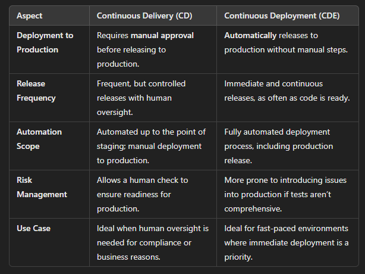
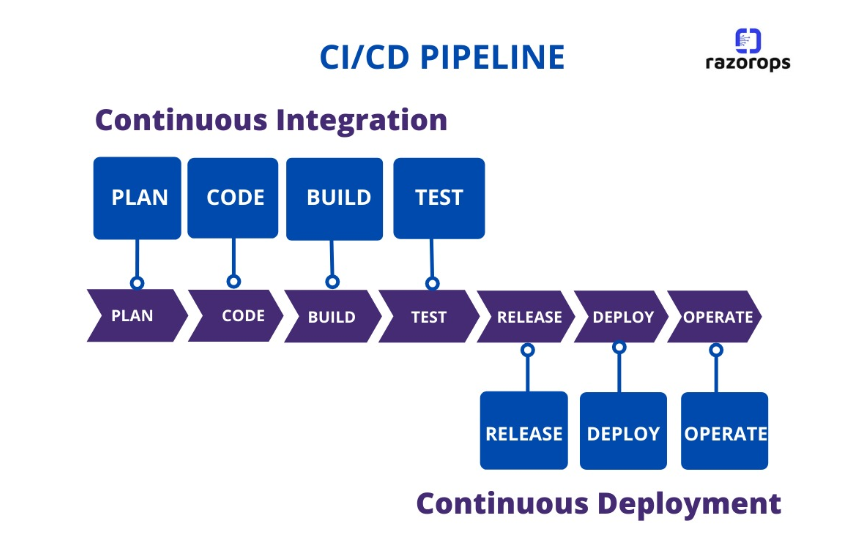

## What is CI? Benefits?
Continuous Integration (CI) is a software development practice where developers regularly integrate their code changes into a shared repository.

**The benefits**:
- There is automated testing when a code is integrated, this allows for early error detection and minimizes merge conflicts 
- Developers collaborate more effectively by integrating their changes frequently, fostering better communication among teams. 
- Automated testing and builds, CI enables faster delivery of new features and fixes
- Better transparency between team members 
- Catching bugs early in the development process is less costly than fixing them after release.

## What is CD? Benefits?
Continuous Delivery extends CI by automating the release process so that changes to code can be deployed to production (or staging environments) quickly and safely.

**The benefits**:
-  Allows companies to bring new features, updates, and bug fixes to users faster, improving competitiveness and responsiveness to market changes.
-  Smaller, more frequent releases are less risky than large, infrequent ones. Issues are identified and addressed earlier in the development cycle.
- Enforces rigorous automated testing at every stage of the pipeline, this reduces the chance of introducing bugs and increases overall software reliability.
- Automated processes reduce the chance of human error, making deployments more predictable.

## Difference between CD and CDE

## What is Jenkins?
Jenkins (automation server) used to automate various parts of the software development lifecycle, particularly CI and CD. It automates the process of building, testing, and deploying applications.

## Why use Jenkins? Benefits of using Jenkins? Disadvantages?

**Benefits**:
- Automates build, test, and deployment tasks that are repetitive
- Enables teams to integrate code more frequently (CI). Each commit triggers an automated build and test process, which helps identify integration issues earlier in the development cycle.
- Pipelines can be scripted with Jenkinsfiles, making them versionable and transparent.
- Supports distributed builds, allowing the workload to be shared across multiple machines.
- Supports over 1,800 plugins, enabling integration with a wide range of tools (Git, Docker, Maven, Kubernetes, and cloud platforms like AWS and Azure).
- Open-sourced with a large, active community.
- Works on various platforms, including Linux, Windows, and macOS

**Disadvantages**:
- Can be complex to set up, configure, and maintain, especially in large, distributed environments.
- Resource-intensive, particularly when running complex pipelines or many concurrent builds. It requires sufficient hardware resources (CPU, memory) to operate efficiently.
- Jenkins requires manual effort to configure jobs, pipelines, security settings, and plugins.
- As Jenkins is highly extensible via plugins, security vulnerabilities may arise if insecure or outdated plugins are used. 

## Stages of Jenkins
- Build: Compile code and package it.
- Test: Run automated tests to ensure quality.
- Static Code Analysis: Check code quality and security vulnerabilities.
- Integration: Integrate and test the system as a whole.
- Deploy: Deploy the application to an environment.
- Acceptance: Run acceptance or QA tests to validate business requirements.
- Publish/Post-Build: Archive artifacts, generate reports, and send notifications.
- Notification: Notify teams of the build status.

## What alternatives are there for Jenkins
1. **GitLab CI/CD**
   - Integrated with GitLab repositories
   - YAML-based pipelines
   - Strong Docker and Kubernetes support

2. **CircleCI**
   - Cloud-based with Docker focus
   - GitHub/Bitbucket integration
   - Fast and simple setup

3. **Travis CI**
   - Cloud-based, GitHub-centric
   - Easy `.travis.yml` setup
   - Free for open-source projects

4. **TeamCity**
   - Enterprise-grade CI/CD by JetBrains
   - Extensive plugin ecosystem
   - Free for smaller teams

5. **Bamboo**
   - Atlassian CI/CD tool
   - Jira and Bitbucket integration
   - Paid-only with enterprise features

6. **Azure DevOps Pipelines**
   - Native Azure integration
   - Multi-cloud support
   - Free tier for small projects

7. **GitHub Actions**
   - GitHub-native automation
   - Marketplace for reusable workflows
   - YAML-based configuration

8. **Spinnaker**
   - Multi-cloud deployment platform
   - Advanced canary and blue-green deployments
   - Developed by Netflix

9. **Drone**
   - Focus on containerized builds with Docker
   - Supports multiple programming languages
   - Kubernetes-native

## Why build a pipeline? Business value?
- Faster Time-to-Market
- Improved Code Quality
- Reduced Human Error#
- Cost Efficiency
- Enhanced Collaboration
- Faster Feedback
- Consistency in Deployment
- Increased Scalability

## Create a general diagram of CICD

## Understand SDLC workflow: plan, design, develop, deploy

1. **Plan**
   
Objective: To define the project scope, goals, and resources needed.

Activities:
Gather requirements from stakeholders (clients, users, management).

Analyze feasibility (technical, operational, financial).

Create a project plan outlining timelines, budget, and resources.

Identify risks and develop mitigation strategies.

Outcome: A clear project scope document and project plan that guide the development process.

2. **Design**
   
Objective: To create the architecture and design of the system based on the requirements gathered.

Activities:
Define system architecture (high-level design).

Create detailed design specifications (low-level design) for each component.

Design user interfaces, databases, and data flow.

Review design documents with stakeholders for approval.

Outcome: Comprehensive design documentation that serves as a blueprint for the development phase.

3. **Develop**
   
Objective: To transform design specifications into functional software.

Activities:
Write code according to design specifications using programming languages and tools.

Conduct unit tests to ensure individual components function correctly.

Perform code reviews to maintain quality and consistency.

Document code and development processes.

Outcome: A working software application that meets the specified requirements, ready for
further testing.

4. Deploy
   
Objective: To deliver the developed application to users and make it operational.

Activities:
Prepare deployment plans, including configuration and data migration if needed.

Deploy the application to production environments.

Monitor the deployment for issues and gather user feedback.

Provide training and support to users if necessary.

Outcome: The software is live and accessible to users, with ongoing monitoring and support in place for maintenance.